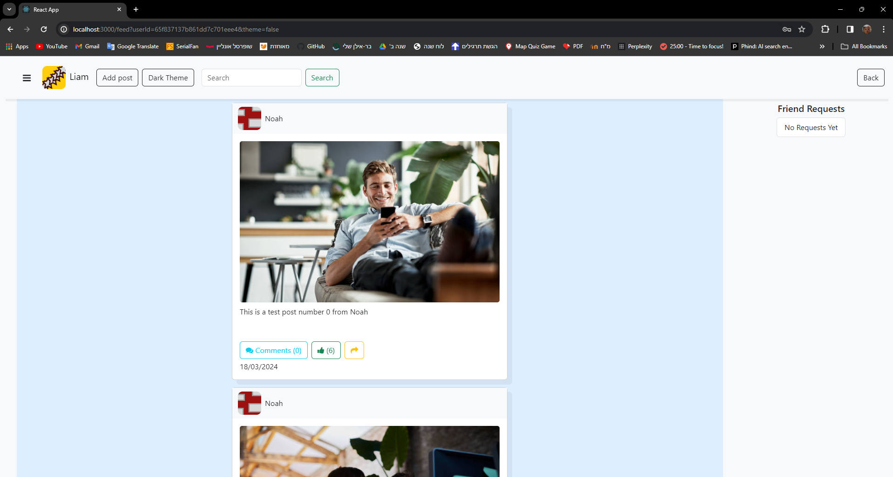
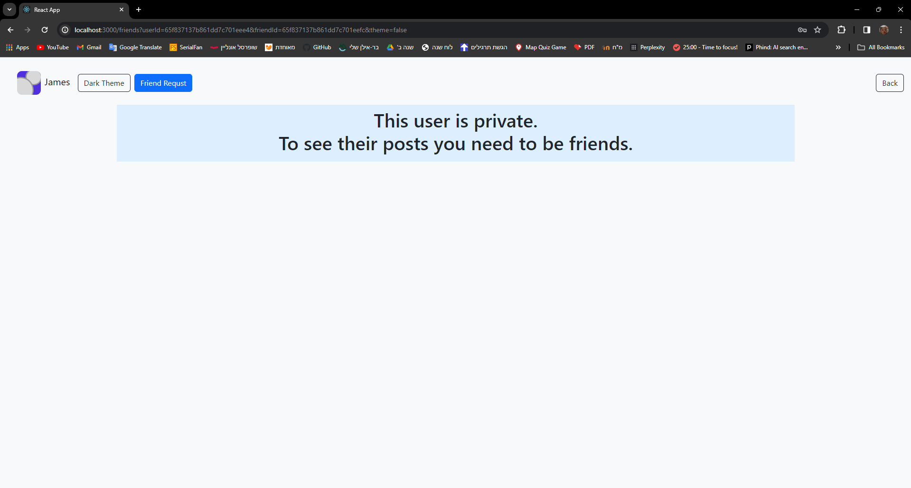
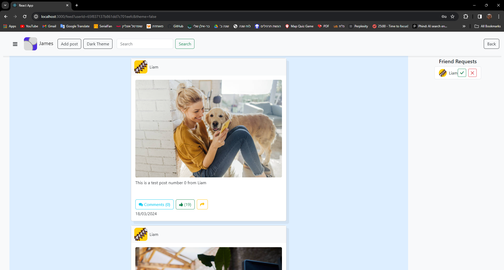

## web

Link to our wiki : [wiki](https://github.com/suarezmanuel/Manikel/wiki)<br>
server app: [link](https://github.com/MikeShlapakov/Manikel-server-side/tree/part_3) <br>
android app: [link](https://github.com/MikeShlapakov/Manikel-android-app/tree/part_3)

nodejs web application that talks asynchornically with the exposed RESTful API of the server,
in order to display/update posts and user friendship connections. <br>

#### API:
```
  // user API
  createUser, getUsers, getUser, editUser, deleteUser

  // token checks
  createToken, isLoggedIn

  // friends API
  getFriends, sendFriendRequest, acceptFriendRequest, deleteFriendRequest

  // posts API
  createPost, editPost, updateLikeAmount, deletePost, getPosts, getPostById, getTargetPosts, getNonTargetPosts
```


#### features
- creates tokens for logged in users, that will get verified via JWT
- queries without tokens wont work and will automatically be sent to the main page
- makes use of flex such that the UI matches the screen size
- uses bootsrap for the main components in the index.html
- make friends, edit your own posts
- comments work


#### to run
1. `npm install`
2. `npm start`

<br>

> make sure you are connected to `http://localhost:3000`, and that the server is running before you try to use any features.

#### images




